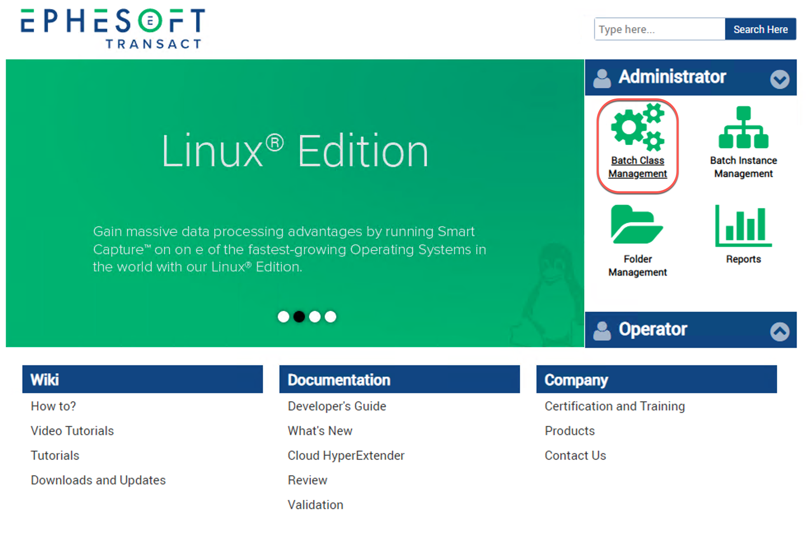
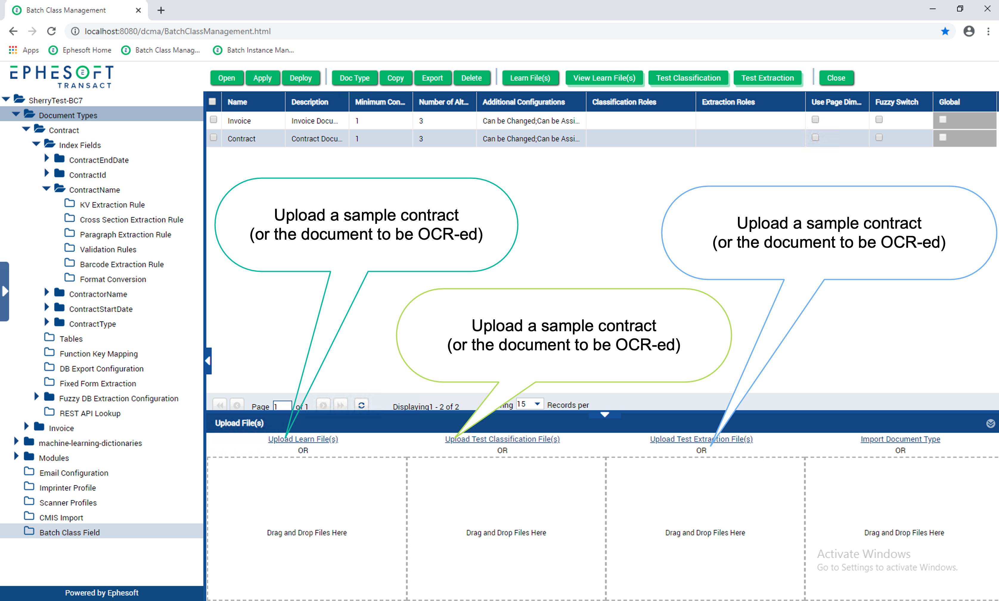
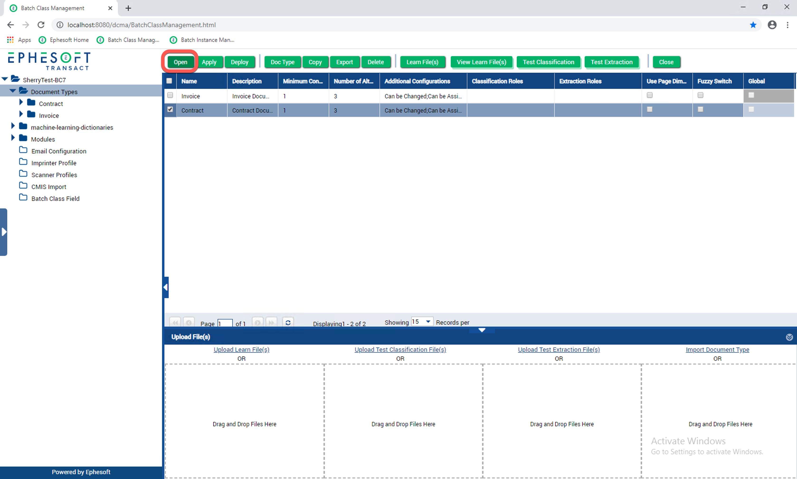
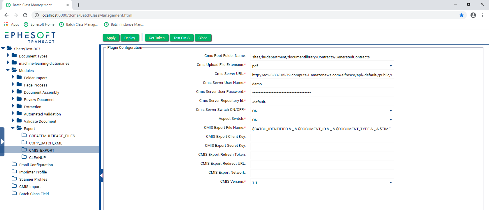

# Ephesoft Configuration Steps

## 1. Prepare and manage batch classes
Please follow these steps for batch class management.
1. Login to [Batch Class Management](http://<host-name>:8080/dcma/BatchClassManagement.html)
2. Credentials -  `ephesoft/demo`
3. Successful login will route to this Batch Class Management screen. Double click the last row, which is the Batch Class created for this tutorial. 
4. Ephesoft has to be trained on the files that are to be OCR-ed. To do this, please upload a sample of the document as shown here.
5. The view is updated with more details of the batch. Now the document types configured in this batch to be OCR-ed are available.
6. Double click on a Document Type to open it.
7. Select an Index Type related to a Document Type
8. Create Key-Value pairs to mention the keys and values to be extracted.

9. Make sure all the changes are saved and deployed by clicking the `Apply` and `Deploy` buttons.
   
## 2. CMIS Import
   Make sure the values are entered correctly for importing documents from ACS to Ephesoft.

| Property       | Value                                                     |
| -------------- | --------------------------------------------------------- |
| Server URL     | http://\<host-name\>/alfresco/api/cmis/versions/1.1/atom/ |
| Username       | demo                                                      |
| Password       | demo                                                      |
| Repository Id  | -default-                                                 |
| File Extension | pdf;tif                                                   |
| Folder         | sites/hr-department/documentlibrary/Contracts/Drafts      |
| Property       | ephesoft:OCR-ready                                        |
| Value          | ready                                                     |
| New Value      | OCR In Progress                                           |
| CMIS Version   | 1.1                                                       |
| Enabled        | checked                                                   |

More details are available at [Ephesoft Documentation](https://ephesoft.com/docs/install-and-upgrade/4-1-0-0/cmis-import/)

## 3. CMIS Export
   Make sure the values are entered correctly here for exporting documents from Ephesoft to ACS.
   | Property                   | Value                                                                       |
   | -------------------------- | --------------------------------------------------------------------------- |
   | Cmis Root Folder Name      | sites/hr-department/documentlibrary/Contracts/GeneratedContracts            |
   | Cmis Upload File Extension | demo                                                                        |
   | Cmis Server URL            | http://\<host-name\>/alfresco/api/-default-/public/cmis/versions/1.1/atom   |
   | Cmis Server User Name      | demo                                                                        |
   | Cmis Server User Password  | demo                                                                        |
   | Cmis Server Repository Id  | -default-                                                                   |
   | Cmis Server Switch ON/OFF  | ON                                                                          |
   | Aspect Switch              | ON                                                                          |
   | CMIS Export File Name      | ```$BATCH_IDENTIFIER & _ & $DOCUMENT_ID & _ & $DOCUMENT_TYPE & _ & $TIME``` |
   
   More details are available at [Ephesoft Documentation](https://ephesoft.com/docs/cmis-export-plugin-documentation/)

## 4. Updating Document Metadata before exporting.
A mapping document is required to update the metadata of a scan-captured document with the captured values. Ephesoft uses `aspects-mapping.properties` file as the mapping document. 

More information on syntax of this file is available at  [Ephesoft Documentation](https://ephesoft.com/docs/features-and-functions/administrator/moduleplugin-configuration/export-module/cmis-export-plugin-3/)

## 5. Cron job expression
For cron job expression which specify the interval at which CMIS server need to be monitored, user needs to update property `cmisImport.cronxpression` available in `Ephesoft_Home/WEB-INF/classes/META-INF/dcma-cmis-import/cmis-import.properties` file.

```
cmisImport.cronxpression=0 0/15 * ? * *
```

Default value for this property is set to every 15 mins.

## 6. Disabling/Enabling CMIS import functionality
For enabling/disabling CMIS import functionality user can uncomment/comment the following line in `Ephesoft_Home\applicationContext.xml`

```
<import resource=”classpath:/META-INF/applicationContext-dcma-cmis-import.xml” />
```

By default: CMIS import is disabled.

## 7. Troubleshooting

| Error message                              | Possible root cause                                                                                                                                           |
| ------------------------------------------ | ------------------------------------------------------------------------------------------------------------------------------------------------------------- |
| Unable to connect to the server            | Invalid configuration being used for making connection to the cmis server.                                                                                    |
| Error while generating cmis properties xml | Either Ephesoft Application doesn’t have access to write the properties on the disk or Ephesoft was unable to connect to network path while writing the file. |